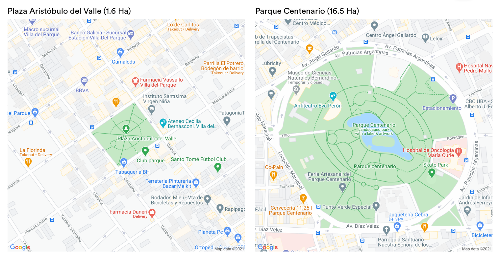
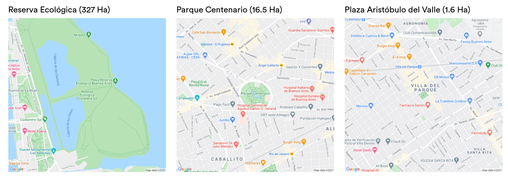
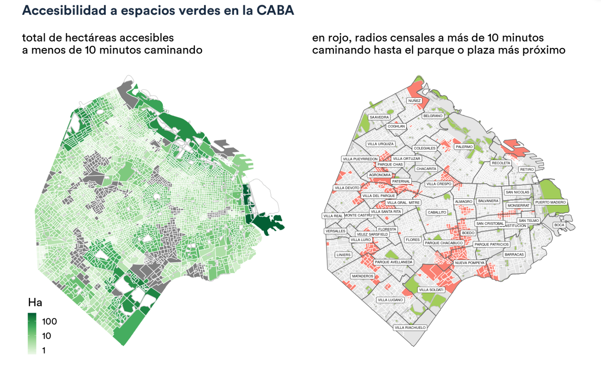
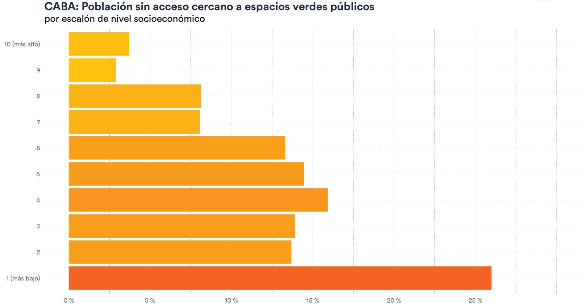
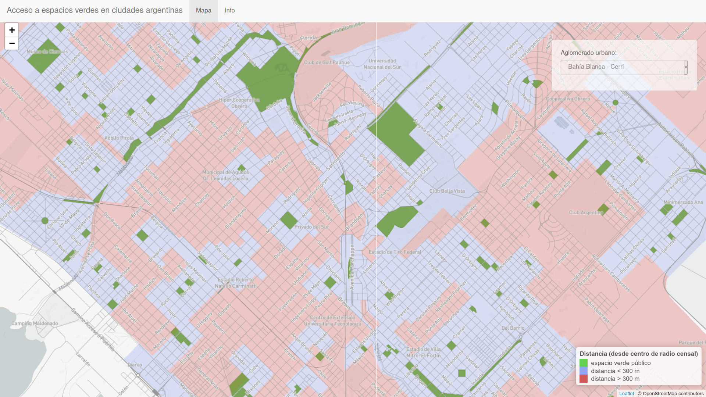

\renewcommand{\figurename}{Figura}

```{r setup, include=FALSE}
knitr::opts_chunk$set(echo = FALSE, warning = FALSE, message = FALSE)
options(scipen = 20)
```


## Problemática ambiental abordada

Entre los 17 Objetivos del Desarrollo Sostenible fijados por Naciones Unidas, el onceavo trata de Ciudades y Comunidades Sostenibles. Entre las metas del objetivo, la primera que se define es la de “asegurar el acceso de todas las personas a viviendas y servicios básicos adecuados, seguros y asequibles y mejorar los barrios marginales”.

El acceso a servicios básicos adecuados es tanto un derecho fundamental para la vida en las ciudades como un inmenso desafío logístico y económico. Planificadores y decisores políticos se enfrentan a una disyuntiva. Por un lado, promover la densidad habitacional que haga viable y sostenible la inversión necesaria, pública y privada, para la provisión de servicios básicos de calidad que alcance a toda la población. Y por otra parte, garantizar la presencia y accesibilidad de espacios verdes, fundamentales para evitar la degradación ambiental: previenen la formación de islas de calor al interrumpir la masa construida, absorben precipitaciones evitando inundaciones, y mejoran la calidad del aire. 

Estudios recientes también han vinculado la presencia de espacios verdes con un efecto beneficioso sobre diversas dimensiones de la salud pública: salud de embarazadas y recién nacidos, desarrollo cognitivo en infantes, salud mental, reducción de morbilidad cardiovascular, de diabetes tipo 2, e incluso reducción general de mortandad.  

La necesidad de atender y planificar espacios verdes urbanos como factores para el desarrollo sostenible se hace aún más importante ante la creciente evidencia de que funcionan como reductores de la desigualdad. Esto es, que los beneficios para la salud asociados con el acceso a espacios verdes tienen un efecto mayor entre la población socioeconómicamente vulnerable.

En la Argentina, la planificación y evaluación de los efectos de espacios verdes públicos se hace difícil, en particular a escala nacional, ante la inexistencia de información oficial y completa respecto a la calidad, ubicación y extensión de las áreas verdes urbanas, así como de estudios sobre sus efectos.

## Objetivos, actividades e indicadores

### Objetivos específicos

El  proyecto contempla contribuir al abordaje de la problemática desarrollando tres recursos de acceso público:

- Un Atlas de Espacios Verdes en Ciudades Argentinas, consistente en una base de datos georeferenciada con la posición, extensión, nombre y otros atributos de cada uno de los espacios verdes de acceso público presentes en las 155 localidades que en su conjunto forman los 32 grandes aglomerados urbanos en la República Argentina.

- Un índice de accesibilidad a espacios verdes, georeferenciado en un mapa de alta resolución espacial (a nivel radio censal) cubriendo las 155 localidades que se aglomeran en los principales centros urbanizados del país. Elaborado siguiendo el marco metodológico “10 minute walk”[^1] [^2] [^3], que propone garantizar al 100% de la población urbana acceso a un espacio verde público a 10 minutos de caminata o menos[^4].

[^1]: https://www.nrpa.org/our-work/partnerships/initiatives/10-minute-walk/10-minute-walk-commitment-framework/
[^2]: https://10minutewalk.org/
[^3]: http://www.fieldsintrust.org/green-space-index


- Un estudio sobre los posibles efectos del acceso a espacios verdes estimando la relación entre accesibilidad, nivel socioeconómico, y dimensiones de la salud como vulnerabilidad sanitaria y mortalidad neonatal.

### Actividades realizadas

- Prospección, recolección, limpieza y cruce de fuentes de información georeferenciada con posición y atributos de espacios verdes urbanos. 

- Generación de una base de datos georeferenciada registrando los espacios verdes presentes en las 155 principales localidades urbanizadas de la Argentina. 

- Validación de los resultados mediante control de calidad por contraste con imagen satelital (inspección visual) y consulta con expertos en la materia. 

- Aplicación de técnicas de análisis geoespacial, y cruce con datos censales y de la Encuesta Permanente de Hogares (INDEC) para establecer cantidad de población servida por espacios verdes, distancias de acceso y otros indicadores asociados, con gran resolución espacial (a nivel radio censal). 

- Elaboración de índices de accesibilidad a espacios verdes públicos de acuerdo a la metodología desarrollada por la Unión Europea para sus indicadores de sustentabilidad (European Common Indicators), para cada uno de los centros urbanizados. 

- Establecimiento de un ranking que expresa la situación relativa de las ciudades Argentinas respecto al acceso que brindan a espacios verdes públicos. 

- Estudio de la relación entre el grado de acceso a espacios verdes de una población y sus índices de mortalidad infantil y maternal, observando una correlación estadísticamente significativa entre ambas. Encontramos que cuanto mayor es el porcentaje de una población que goza de buen acceso a espacios verdes, más bajos tienden a ser sus índices de mortalidad tanto infantil como maternal.

- Desarrollo de una metodología de reporte que describe la situación de accesibilidad a espacios verdes en las principales ciudades de la Argentina. 


## Resultados

El Atlas fue desarrollado para apoyar a la toma de decisiones informada en materia de gestión del espacio público, y logró sus objetivos propuestos: generar la **base de datos georeferenciada** con los espacios verdes de acceso público los 32 grandes aglomerados urbanos de la Argentina, actualizable con frecuencia; desarrollar un **índice de accesibilidad a espacios verdes**; y estudiar la relación entre el índice de accesibilidad y aspectos cŕiticos de la salud pública como la mortalidad infantil y maternal.

En forma adicional, el desarrollo del Atlas propició el inicio de **un programa de investigación**, en progreso^[Bajo este nuevo programa se ha iniciado una colaboración entre la Fundación Bunge y Born y la Facultad de Arquitectura, Planeamiento y Diseño de la Universidad Nacional de Rosario, para extender la metodología del Atlas de Espacios Verdes incorporanbdo nuevas dimensiones de análisis. https://fapyd.unr.edu.ar/convenio-de-colaboracion-fapyd-fundacion-bunge-y-born/], que convoca a urbanistas e investigadores locales para desarrollar diagnósticos precisos sobre la temática. Por ejemplo, la relación entre accesibilidad a espacios verdes, nivel socioeconómico, y dimensiones de la salud pública como mortalidad neonatal o enfermedades crónicas.

Para la elaboración del índice de accesibilidad consideramos que cada espacio verde brinda un servicio cotidiano a la población que reside a una distancia de diez minutos de caminata o menos. Quienes viven a mayor distancia de su opción más cercana representan la población con bajo acceso a plazas y parques. Este “número mágico” se desprende de estudios recientes^[Para un estudio sobre los efectos de la cercanía a espacios verdes en el nivel de actividad física de las personas, y del punto de inflexión que representan los diez minutos de distancia a pie, puede consultarse “Quantifying the Contribution of Neighborhood Parks to Physical Activity” https://www.ncbi.nlm.nih.gov/pmc/articles/PMC3800218] que determinaron la distancia a partir de la cual la población local incorpora el uso de parques y plazas a su rutina diaria. El mismo umbral es tomado por iniciativas como  “10 Minute Walk” (10minutewalk.org), una coalición entre ONGs y gobiernos municipales en los Estados Unidos, que se compromete a garantizar el acceso a espacios verdes públicos a  menos de diez minutos de caminata para el 100% de la población urbana. 

Como fuente de _Big Data_ territorial, de la cual extrajimos la posición de las áreas parquizadas en nuestras ciudades, contamos con la base de datos geoespaciales del proyecto OpenStreetMap (openstreetmap.org); se trata de un repositorio global de información georeferenciada, mantenido por voluntarios y voluntarias que mapean con gran precisión las calles, parques, estaciones de transporte, hospitales y un sinfín de otros atributos de las ciudades del mundo, y que debido a su cobertura se ha convertido en una fuente de información invaluable para la investigación urbana. 

Para crear y mantener actualizado el Atlas de Espacios Verdes, desarrollamos un sistema automatizado que accede a esta base de datos (en constante actualización) y que identifica y extrae el perímetro de todos los espacios verdes públicos cuya posición pertenece a alguna de las 155 localidades que conforman los aglomerados urbanos de la Argentina. PPara refinar el análisis,  de los polígonos verdes obtenidos seleccionamos aquellos que superan los 5.000 m^2^ de superficie (media hectárea), que pasan a formar nuestro catálogo de espacios verdes.  La superficie mínima es la misma que utilizó la Unión Europea para medir disponibilidad de espacios abiertos públicos para el programa de  Indicadores Europeos de Sustentabilidad^[European Common Indicators: towards a local sustainability profile. https://www.gdrc.org/uem/footprints/eci_final_report.pdf]. La condición se utiliza para retirar del análisis a pequeños espacios verdes públicos que aparecen en los registros pero no permiten actividad física comunitaria, por ejemplo, terraplenes, bulevares con césped, etc.


### Ejemplo: La situación en la Ciudad Autónoma de Buenos Aires

En la Ciudad Autónoma de Buenos Aires encontramos un total de casi 15 millones de m^2^ de espacios verdes públicos, entendidos como superficies verdes de libre acceso de más de media hectárea. La población de la ciudad se ha mantenido estable en las últimas décadas, creciendo poco más de un 4% entre los censos de 2001 y 2010. Aún asumiendo que la población se ha incrementado en la última década, podemos trabajar con la población estimada en 2010, muy cerca de los tres millones: 2.980.642 habitantes. Esto indica que **en la Ciudad Autónoma de Buenos Aires se dispone de casi 5,13 m^2^ de espacio verde per cápita.**

En comparación con lo que ofrecen otras ciudades, resulta poco. Utilizando similares fuentes de datos, en Nueva York un análisis reciente encontró 13,6 m^2^ por habitante^[The Allocation of Space in U.S. Cities. https://www.geotab.com/urban-footprint], y cantidades aún mayores en el resto de las 50 urbes principales de Estados Unidos. Del mismo modo, en Europa un estudio determinó más de 30 m^2^ por habitante en Bruselas^[The provision of urban green space and its accessibility: Spatial data effects in Brussels. https://journals.plos.org/plosone/article?id=10.1371/journal.pone.0204684], la capital de Bélgica. 

Sin embargo, los metros cuadrados por habitante no cuentan toda la historia. Para empezar, no existe una cantidad mínima que podamos tomar como meta. Suele citarse una “recomendación de la Organización Mundial de la Salud” de 9 m^2^ por habitante, que al parecer es un mito: la OMS nunca se pronunció en forma oficial al respecto.

Quizás no importe tanto encontrar una cantidad “justa” de metros cuadrados. El consenso entre quienes estudian el tema de la provisión de espacios verdes urbanos es enfocarse en la _accesibilidad_: no en la superficie que suman los espacios verdes, sino en dónde están y por tanto quienes tienen fácil acceso a ellos. Este giro hacia la accesibilidad está presente en la propuesta de Ann Hidalgo, alcaldesa de París, de lograr la “ciudad de los 15 minutos”, asegurando que todos sus habitantes tengan todo lo que necesitan a menos de 15 minutos de caminata. Por supuesto, la distancia ideal dependerá de cada servicio urbano. Para los parques y otros espacios verdes, ya mencionamos que una distancia de 10 minutos a pie o menos es el umbral a partir del cual se observa que los vecinos los usan para la mayor parte de su actividad física. Y esta idea ha impulsado iniciativas como 10 minute walk en los Estados Unidos, que suma la adhesión de alcaldes para lograr que el 100% de la población tenga acceso a un espacio verde a diez minutos de caminata.

La siguiente pregunta a responder es, entonces, ¿qué porcentaje de la población en la Ciudad Autónoma de Buenos Aires carece de opciones cercanas al lugar en el que viven para su recreación y actividad física?

#### ¿Cuánta gente en la CABA tiene acceso suficiente a espacios verdes públicos?

Como mencionamos antes, incluimos en el análisis los espacios que superen la media hectárea de extensión, de acuerdo a estándares internacionales que definen ese mínimo suficiente para recreación y actividad física. Para imaginar cuánto representa media hectárea, podemos pensarlo como un tercio de manzana. La Plaza Aristóbulo del Valle en el barrio porteño de Villa del Parque, que ocupa una manzana, alcanza 15900 m^2^ de superficie: 1,59 hectáreas. Un parque, como el Parque Centenario, puede alcanzar diez veces esa cantidad.

```{r dpi =300, fig.cap="Comparación de escala entre Plaza Aristóbulo del Valle y Parque Centenario"}

```

El espacio verde continuo más grande de la Ciudad, la Reserva Ecológica, ocupa 327 hectáreas. Proyectado en un mapa en la misma escala que los dos ejemplos anteriores, se aprecia su magnitud. 

```{r dpi =300, fig.cap="Comparación de escala entre la Reserva Ecológica y ejemplos de parque y plaza"}

```

La posición de la Reserva Ecológica en un extremo de la ciudad, junto a su notable superficie, nos da una pista de por qué no es óptimo estimar el acceso a espacios verdes en función de los m^2^ por habitante: no tiene sentido repartir las más de 300 hectáreas de la Reserva entre todas y cada una de las personas que vive en la ciudad, cuando para la gran mayoría de ellas no existe la posibilidad de visitarla como parte de su rutina cotidiana. Vale insistir, la variable del tiempo es clave, habiéndose demostrado que para gozar del uso cotidiano de los parques necesitamos tenerlos al alcance de una caminata breve.
Por eso, para medir accesibilidad estimamos _isócronas_ (la distancia que se puede cubrir viajando por determinado tiempo) de diez minutos a pie en torno a cada radio censal de la ciudad. Los radios censales son las unidades geográficas oficiales más pequeñas en la Argentina. Cada uno contiene unas 300 viviendas, y cuenta con información demográfica detallada gracias al Censo Nacional de Población, Hogares y Viviendas de 2010, como la cantidad de personas que allí vive, sus edades, nivel educativo, condición de empleo, etc. Esto nos permite entender no sólo a _cuánta_ gente involucra la situación que estamos estudiando, sino también a _quiénes_ afecta.  Con nuestra metodología, si la isócrona en torno al centro de un radio censal llega hasta un espacio verde significa que se puede caminar hasta allí en diez minutos o menos, y por tanto la población residente tiene la posibilidad de acceder con facilidad.

```{r dpi =300, fig.cap="Accesibilidad a espacios verdes en la Ciudad Autónoma de Buenos Aires"}

```

Así, encontramos que gran parte de la superficie de la ciudad se encuentra a menos de diez minutos de caminata de un parque o plaza. Pero también que existen amplios corredores urbanos donde la población reside a una distancia mayor al umbral recomendado.

Si sumamos los habitantes de los radios censales con bajo acceso, encontramos que un 12,4% de la población de la Ciudad reside lejos de un espacio verde público; es decir, **a más de 350.000 porteños les falta un parque o plaza más cerca de su vivienda.**

Si observamos, además, la accesibilidad considerando las condiciones de vida de la población afectada, los resultados muestran una situación más grave para la población de menores recursos. Luego de clasificar a la población en deciles de acuerdo a su nivel socioeconómico, encontramos que la población más vulnerable sufre en forma desproporcionada la falta de acceso a espacios verdes.

```{r dpi =300, fig.cap="Distribución de población con acceso suficiente a espacios verdes, de acuerdo a nivel socioeconómico, Ciudad Autónoma de Buenos Aires"}

```

El 25% de la población de menor nivel socioeconómico carece de acceso a espacios verdes, situación que sólo afecta a un 4% de las personas de mayores ingresos de la ciudad.

## Entregables - Construyendo conocimiento en forma colaborativa

La metodología del Atlas de Espacios Verdes está diseñada para ser replicada en cualquier ciudad de la Argentina por grande o pequeña que sea, e incluso en cualquier ciudad de cualquier país. Todas los datos que procesa provienen de fuentes públicas y abiertas: algunas con cobertura global (los espacios verdes públicos extraídos de la base de datos de OpenStreetMap) y otros provistos por las agencias nacionales de estadística y censo (los datos censales).

La Fundación Bunge y Born trabaja en la actualidad con equipos de trabajo de Universidades Nacionales en distintos puntos del país, desarrollando nuevos indicadores y diagnósticos, extendiendo la metodología y agregando nuevas fuentes de datos para analizar en detalle la situación en grandes ciudades elegidas como escenario piloto, cuyos resultados podrán ser replicados luego en otros municipios.

Para permitir que cualquiera pueda acceder a nuestros datos y aprovechar nuestro trabajo, también hemos publicado las bases de datos y el código de programación que permite automatizar la renovación de la información y la producción de métricas de accesibilidad,  disponible con acceso público. 

En el sitio del proyecto, www.fundacionbyb.org/atlas-espacios-verdes-argentina,  se puede descargar la base de datos georeferenciada, en formato estándar para ser leído con cualquier herramienta digital de análisis de información geográfica. También se comparten resultados de análisis en forma de tablas descargables con indicadores avanzados como porcentaje de la población con acceso a espacios verdes, total de hectáreas accesibles, y m^2^ accesibles per cápita, por estrato de nivel socioeconómico, y tanto a nivel de localidad como de aglomerado urbano.

Y por último, para facilitar la consulta de los datos por parte del público general se ofrece una herramienta de visualización de los datos, que muestra en el mapa la posición y superficie de los espacios verdes en cada gran ciudad de la Argentina.


### Atlas de Espacios Verdes en Ciudades Argentinas

La base de datos con los polígonos georeferenciados de los espacios verdes urbanos relevados en el territorio de la República Argentina puede descargarse siguiendo el enlace: __[Base georeferenciada de espacios verdes urbanos publicos en Argentina](https://github.com/bitsandbricks/atlas_espacios_verdes/tree/master/data/processed/osm)__. 


El formato de los datos es ESRI shapefile, que puede ser leído con herramientas con interfaz gráfica de libre acceso como _QGIS_ (www.qgis.org), o con librerías especializadas como `sf` para el lenguaje de programación R (r-spatial.github.io/sf/) y `GeoPandas` para el lenguaje Python (geopandas.org).


### Índice(s) de accesibilidad a espacios verdes

Las métricas de accesibilidad están disponibles en los siguientes enlaces. La estructura de los datos es _csv_ (_comma-separated values_), un formato abierto sencillo para tablas. Puede ser leído con herramientas de ofimática de libre acceso como _LibreOffice_ (libreoffice.org) o cualquier software, lenguaje de programación o librería para análisis de datos.


#### Indicadores básicos

- A nivel aglomerado urbano: __[m^2^ de espacio verde por habitante (indicador global)](https://raw.githubusercontent.com/bitsandbricks/atlas_espacios_verdes/master/data/processed/metricas/m2_espacio_verde_por_habitante_aglomerados.csv)__

- A nivel localidad: __[m^2^ de espacio verde por habitante (indicador global)](https://raw.githubusercontent.com/bitsandbricks/atlas_espacios_verdes/master/data/processed/metricas/accesibilidad_espacios_verdes_localidades.csv)__

#### Indicadores avanzados

- A nivel aglomerado urbano: __[porcentaje de la población con acceso a espacios verdes, total de hectáreas accesibles, y m^2^ accesibles per cápita, por estrato de nivel socioeconómico](https://raw.githubusercontent.com/bitsandbricks/atlas_espacios_verdes/master/data/processed/metricas/accesibilidad_espacios_verdes_aglomerados.csv)__

- A nivel localidad: __[porcentaje de la población con acceso a espacios verdes, total de hectáreas accesibles, y m^2^ accesibles per cápita, por estrato de nivel socioeconómico](https://raw.githubusercontent.com/bitsandbricks/atlas_espacios_verdes/master/data/processed/metricas/accesibilidad_espacios_verdes_localidades.csv)__


#### Herramienta de visualizacion

La aplicación interactiva disponible en www.fundacionbyb.org/atlas-espacios-verdes-argentina muestra en el mapa la posición y superficie de los espacios verdes identificados. También provee un indicador preliminar de accesibilidad para cada radio censal, tomando como umbral una distancia de 300 metros lineales hasta el espacio verde público más cercano. 

```{r dpi=300, fig.cap="Herramienta de visualización disponible en www.fundacionbyb.org/atlas-espacios-verdes-argentina"}

```
